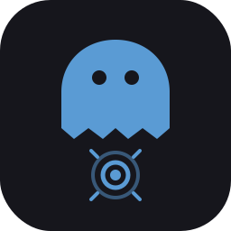

<p align="center">
  
</p>

<h1 align="center">GhostTap</h1>

<p align="center">
  <b>A highly customizable, humanized auto-clicker for Minecraft 1.8.9 (Forge).</b><br>
  Two independent clickers, deep humanization, a full in-game config UI, a live HUD, and per-click analytics.
</p>

<p align="center">
  
  
  
  
</p>

<p align="center">
  
  <br><sub><i>(placeholder — hero shot: menu open in-world with the HUD visible)</i></sub>
</p>

---

## Motivation

Most auto-clickers do one of two things: fire a rigid, metronome-perfect click at a fixed rate, or fake input with `java.awt.Robot` / synthetic key events. Both are trivial to spot — a perfectly even click interval is not something a human hand produces, and injected input often does not line up with how the game actually reads the mouse.

GhostTap was built around two goals:

1. **Look human.** Every click's timing and hold duration is drawn from tunable statistical distributions — mean, deviation, min/max bounds, random spikes and stutters, occasional "heavy" holds, and a slow rhythmic drift — so no two clicks are identical and the long-term pattern wanders the way a real hand does.
2. **Be low-footprint and controllable.** Input is spoofed at the **LWJGL layer**, not through fake OS events, so the game reads it through its normal mouse pipeline. Everything is configured through a clean in-game panel — no config-file editing required.

It is an *internal* mod (a Forge coremod + mixin), not an external overlay, which is what lets it hook the input layer directly and combine your real mouse with the spoofed clicks seamlessly.

---

## Features at a glance

- **Two fully independent clickers** — left and right, each with its own timing, filters, mode, and keybind.
- **Three activation modes** — Toggle, Hold, and Mouse (arm-then-hold your real button).
- **Deep humanization** — Gaussian CPS, random spikes/stutters, a full hold-time model, and rhythmic drift.
- **Filters / gates** — restrict clicking by hotbar slot, held-item type, game mode, menus, entity-in-reach, block-breaking, and valid block placement.
- **Live HUD** — CPS counter and per-clicker armed/firing status, fully themeable and anchorable.
- **Per-click analytics** — record every click's timing and export it to CSV, with a bundled Python plotting tool.
- **Config sharing** — export/import any clicker or the HUD as a base64 clipboard token.
- **Convenient access** — a keybind, a silent chat command, and the Forge mods-list "Config" button.

---

## How it works

GhostTap installs a SpongePowered **Mixin** into LWJGL's `org.lwjgl.input.Mouse` — specifically the `poll()` and `next()` methods the game calls every frame to read the mouse.

- When a clicker is **firing**, it injects synthetic **press/release edges** for the target button into the mouse event queue. Because these are discrete down/up events (not a held button), the game processes each as a fresh click — this is what lets right-click placement bypass vanilla's hold-to-place throttle, for example.
- When your clicker is **masked**, GhostTap can hide or combine your **real** physical button state with the spoofed state, so autoclicking and your own mouse never fight each other.
- Nothing uses `java.awt.Robot` or fake keyboard events. The input enters through the same path as a normal mouse, and clicks are timed on two dedicated worker threads that stay parked (zero CPU) whenever the clicker is idle.

Gates (the filters) are evaluated once per client tick on the main thread, where reading game state is safe. The whole thing is deliberately lightweight — idle cost is effectively nothing, and the only real work happens while a clicker is actively firing.

> [!NOTE]
> Because it is a coremod that transforms a class at load time, GhostTap is visible to anti-cheats that scan the client's loaded transformers or mixin platform. It hides your input pattern; it does not hide the fact that a coremod is present. See [Fair use](#fair-use--detectability).

---

## The config menu

Open it with **Right Shift** (rebindable). The menu is a custom dark panel with a tab per area.

<p align="center">
  
  <br><sub><i>(placeholder — General tab)</i></sub>
</p>

### General

Per-clicker activation, plus the HUD and Analytics master switches.

| Setting | Description |
|---|---|
| **Enabled** | Turn the clicker on/off. In Hold mode this follows your key; in Mouse mode it arms/disarms. |
| **Mode** | Toggle / Hold / Mouse (see [Activation modes](#activation-modes)). |
| **Start delay** | *(Mouse mode only)* How long the mouse must be held before autoclicking starts, so a quick tap passes through as a single click. |
| **Key** | The clicker's key — supports keyboard keys **and** mouse buttons (side buttons, scroll-click). |
| **Config** | Reset / Export / Import this clicker's settings. |

### Left & Right (per clicker)

Each clicker tab is split into three sub-tabs.

<p align="center">
  
  <br><sub><i>(placeholder — CPS sub-tab)</i></sub>
</p>

**CPS** — the core click-rate model:

| Group | Options |
|---|---|
| **CPS** | Mean, Std deviation, Min, Max, and Min/Max fallout (how far the rate may drift past the bounds before being reeled back). |
| **Spike** | Chance, Min, Max — a short burst of *extra* speed. |
| **Stutter** | Chance, Min, Max — a short hitch that *slows down*. |

> Mean widens the Min/Max range if you drag it past them, and Min/Max push the Mean back in — the relationship is kept consistent from both sides.

**Fatigue** — how each individual click *feels*:

| Group | Options |
|---|---|
| **Hold (ms)** | Mean, Std deviation, Min, Max — how long each click is physically held down. |
| **Heavy hold** | Chance, Min, Max — an occasional noticeably longer hold. |
| **Rhythm** | Volatility and Tension — a slow random-walk drift of the pace, pulled gently back toward the Mean. |

**Filters** — gates that decide when clicking is *allowed*:

| Group | Options |
|---|---|
| **Hotbar slots** | Per-slot 1–9 whitelist. |
| **Held item** | Weapons, Tools, Blocks, Other. |
| **Rules** | *Break blocks* (left only — pause while aimed at a mineable block), *Placeable only* (right only — see [below](#placeable-only)), *In menus*, *Pause on item use*, *Entity only* + random *Reach min/max*. |
| **Game mode** | Survival, Creative, Adventure. |

<p align="center">
  
  <br><sub><i>(placeholder — Filters sub-tab)</i></sub>
</p>

### HUD

<p align="center">
  
  <br><sub><i>(placeholder — HUD showing CPS + status)</i></sub>
</p>

| Setting | Description |
|---|---|
| **Left / Right CPS** | Show each clicker's clicks-per-second (`CPS: L \| R`). |
| **Clicker status** | Per-clicker `ON/OFF` (armed) **and** `FIRE/IDLE` (actually clicking now) plus mode. |
| **Hide in menus** | Hide the HUD while the F3 debug overlay is up. |
| **Text colour / Background / Padding** | Hex colours for text and box, toggleable background, adjustable padding. |
| **Anchor / Margin** | Snap to any screen corner (auto-resizing) or place manually, with an edge-gap margin. |
| **Config** | Reset / Export / Import the whole HUD. |

### Analytics

<p align="center">
  
  <br><sub><i>(placeholder — Analytics tab)</i></sub>
</p>

Toggle recording on/off and export the collected data. See [Analytics](#analytics-1).

---

## Activation modes

| Mode | Behaviour |
|---|---|
| **Toggle** | Press the key once to switch the clicker on; press again to switch off. |
| **Hold** | Clicks only while the key is held down. |
| **Mouse** | Press the key to **arm** the clicker, then hold your **real** mouse button to click. Disarm with the key again. Ideal for combat/bridging where you want the autoclicker "ready" but only active while you're actually holding the button — optionally with a **Start delay** so a quick tap is a normal single click. |

---

## <a id="placeable-only"></a>Placeable only (right clicker)

A right-click gate that fires **only when the held block would actually be placed** where you are aiming. It mirrors the game's own placement logic (`ItemBlock.onItemUse` + `World.canBlockBePlaced`), including the entity-collision check — so it never wastes a click aiming into the floor, into a cell you're standing in, or at empty air. Works correctly with slabs, stairs, and other special-placement blocks.

Great for stacking and bridging (every click lands a valid placement). Note the trade-off discussed under [Fair use](#fair-use--detectability): perfect placement efficiency is *cleaner* mechanically but *less human-looking* on a CPS meter.

---

## Analytics

When enabled, every click (spoofed **and** real) is recorded with:

- timestamp, target CPS, actual measured CPS,
- hold duration (measured precisely, even for real physical clicks in Mouse mode),
- interval to the next click, and the current rhythm trend.

Export writes a **CSV to your Desktop**. A small Python project under [`tools/`](tools/) reads the CSV and plots the distributions so you can visually tune your humanization.

<p align="center">
  
  <br><sub><i>(placeholder — example distribution plots)</i></sub>
</p>

---

## Config sharing

Every clicker and the HUD can be **exported to a base64 token** (copied to your clipboard) and **imported** the same way — perfect for sharing a tuned profile or backing one up. Settings also persist automatically to the Forge config file between sessions.

---

## Access & controls

- **Config menu:** Right Shift (rebindable on the General tab).
- **Silent chat command:** type `.ghosttap` in chat to open the menu. The command is **intercepted before it is sent** — it never appears in chat and is never sent to the server, and it is **not** tab-completable (so it won't show up while screen-sharing). Use `.ghosttap key <name>` to rebind the menu key.
- **Mods list:** GhostTap also registers a **Config** button in the Forge/mod-manager mods list.
- **Clicker keys:** default `N` (left) and `M` (right) — rebindable, and they accept mouse buttons too.

---

## Fair use & detectability

GhostTap is a research/personal project. A few honest points:

- **Input pattern:** the humanized timing and LWJGL-layer spoofing make the *input* hard to distinguish from a real hand. There are no fake OS events and no perfectly even intervals.
- **Coremod visibility:** it is still a coremod. Anti-cheats that scan the client (loaded transformers, the mixin platform, class presence) can detect that *a* coremod is running, regardless of how human the clicks look.
- **Efficiency vs. realism:** filters like *Placeable only* make you mechanically flawless (100% valid placements, zero wasted clicks). That is efficient, but a perfectly clean pattern at a low click-rate can itself look non-human to an observer or a CPS meter. Tune with that trade-off in mind.

Use it where you're allowed to. Don't use it to break rules you've agreed to.

---

## Installation

1. Install **Minecraft 1.8.9** with **Forge** (`11.15.1.2318` or compatible).
2. Drop `GhostTap-1.0.jar` into your `mods/` folder.
3. Launch, and press **Right Shift** in-game to open the menu.

---

## Building from source

Requires **JDK 8** — the toolchain (ForgeGradle 2.1) will not run on newer JDKs.

```sh
JAVA_HOME=<path-to-jdk8> ./gradlew build
```

The built jar lands in `build/libs/GhostTap-1.0.jar`.

---

## License

Licensed under the **GNU General Public License v3.0** — see [LICENSE](LICENSE).
