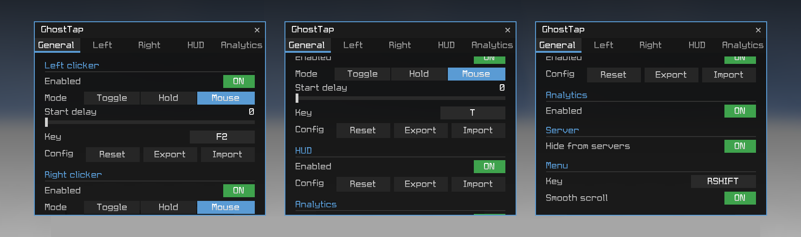
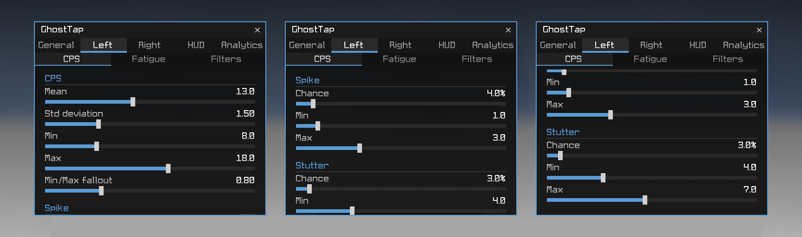
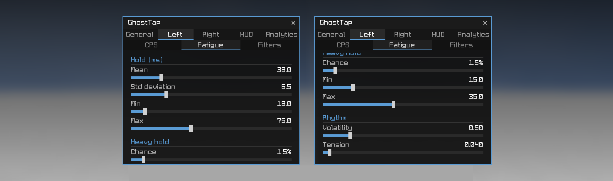
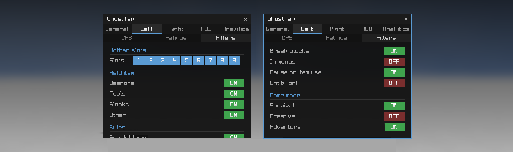
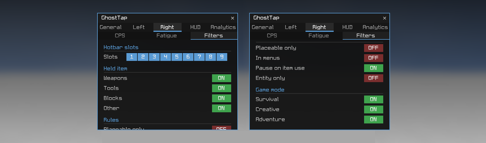
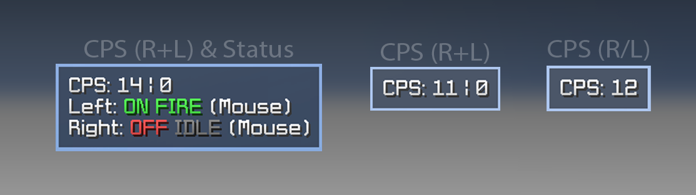
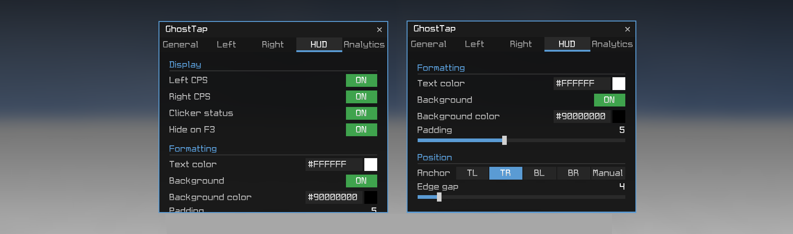
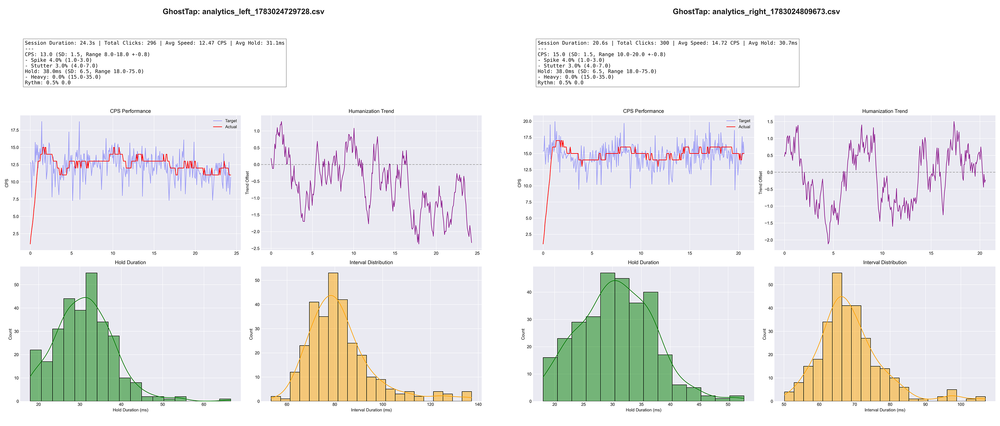

<p align="center" xmlns="http://www.w3.org/1999/html">
  
</p>

<h1 align="center">
  GhostTap
</h1>
<h3 align="center">
  <a href="https://github.com/IcySnex/GhostTap/releases/latest">
    
  </a>
  <span> ˙ </span>
  <a href="https://www.curseforge.com/minecraft/mc-mods/ghosttap-clicker">
    
  </a>
  <span> ˙ </span>
  <a href="https://modrinth.com/mod/ghosttap-clicker">
    
  </a>
</h3>


<table>
  <tr>
    <td width="99999" align="center">
      <b>A lightweight internal auto‑clicker focused on customization and undetectability.</b>
      <br/>
      Independent clickers for Left/Right  · depp humanization · fully customizable with in-game UI · live HUD · click analysis
    </td>
  </tr>
</table>

<h3 align="center">
  <a href="https://minecraft.wiki/w/Java_Edition_1.8.9">
    
  </a>
  <span> ˙ </span>
  <a href="https://files.minecraftforge.net/net/minecraftforge/forge/index_1.8.9.html">
    
  </a>
</h3>

<p align="center">
  
</p>

---

## Features

- **Two fully independent clickers:** left and right, each with its own timing, filters, mode, and keybind.
- **Three activation modes:** Toggle, Hold, and Mouse (arm-then-hold your real button).
- **Deep humanization:** Gaussian CPS, random spikes/stutters, a full hold-time model, and rhythmic drift.
- **Filters / gates:** restrict clicking by hotbar slot, held-item type, game mode, in menus, entity-in-reach, block-breaking (for LMB), and block-placement (for RMB).
- **Live HUD:** CPS counter and per-clicker armed/firing status, fully themeable and anchorable.
- **Per-click analytics:** record every click's timing and export it to CSV to evaluate it later with a Python plotting tool.
- **Config sharing:** export/import any clicker or the HUD as a base64 clipboard token.

---

## Motivation

Anyone who plays Minecraft PvP 1.8.9 knows how exhausting it is to spam-click for hours on end. That’s where an autoclicker comes in - but most of them simply suck!

Starting with external autoclickers: running as a separate OS process not only consumes more resources and ruins cross-platform support, but it also means they miss out on crucial quality-of-life features - like being able to break blocks, whitelist certain hotbar slots, automatically stop clicking inside menus and inventory or other game-aware filters. And don't get me starting on all the malware they often include...

Finding a good internal autoclicker is just as hard though. The few that exist either fire rigid, metronome-perfect clicks, lack basic features like a right-clicker, or use `java.awt.Robot` / send direct hit packets, which breaks HUD elements like CPS displays and Keystrokes.

GhostTap was built to fix this around two main goals while being fully open-source:

1. **Look human.** Every click's timing and hold duration is drawn from tunable statistical distributions - including mean, deviation, min/max bounds, random spikes and stutters, occasional "heavy" holds, and a slow rhythmic drift - so no two clicks are identical.
2. **Be low-footprint and controllable.** Input is spoofed at the **LWJGL layer**, not through fake OS events, so the game reads it through its normal mouse pipeline. Everything is configured through a clean in-game GUI - no config-file editing required.

---

## How it works

GhostTap installs a SpongePowered **Mixin** into LWJGL's `org.lwjgl.input.Mouse` - specifically the `poll()` and `next()` methods the game calls every frame to read the mouse.

- When a clicker is **firing**, it injects synthetic **press/release edges** for the target button into the mouse event queue.
- When your clicker is **masked**, GhostTap can hide or combine your **real** physical button state with the spoofed state, so autoclicking and your own mouse never fight each other.
- Nothing uses `java.awt.Robot` or fake keyboard events. The input enters through the same path as a normal mouse. This means **all** HUD mods like *CPS Display* or *Keystrokes* still work flawlessly.
- Clicks are timed on two dedicated worker threads that stay parked (zero CPU) whenever the clicker is idle, making the mod super lighweight.
- Gates (the filters) are evaluated once per client tick on the main thread, where reading game state is safe - so the only real work happens while a clicker is actively firing.

> [!NOTE]
> Because it is a coremod that transforms a class at load time, GhostTap is visible to client-side anti-cheats that scan for loaded transformers or mixin platform. It hides your input pattern and the modinfo from servers; it does not hide the fact that a coremod is present. See [Fair use](#fair-use--detectability).

---

## The config menu

Open it with **Right Shift**. If this button is currently taken you can use `.ghosttap key <KEY>` in chat to rebind it. The menu is a custom dark panel with a tab per area.

<p align="center">
  
</p>

### General

Per-clicker activation, plus the HUD and Analytics master switches. Also a toggle to hide the mod from Forge servers.

| Setting | Description                                                                                                                      |
|---|----------------------------------------------------------------------------------------------------------------------------------|
| **Enabled** | Turn the clicker on/off. In Toggle/Hold mode this follows your key; in Mouse mode it arms/disarms.                               |
| **Mode** | Toggle / Hold / Mouse (see [Activation modes](#activation-modes)).                                                               |
| **Start delay** | *(Mouse mode only)* How long the mouse must be held before autoclicking starts, so a quick tap passes through as a single click. |
| **Key** | The clicker's key - supports keyboard keys **and** mouse buttons (side buttons, scroll-click).                                   |
| **Config** | Reset / Export / Import this clicker's settings.                                                                                 |

#### Activation modes

| Mode | Behaviour                                                                                                                                                                                                                                                                                                              |
|---|------------------------------------------------------------------------------------------------------------------------------------------------------------------------------------------------------------------------------------------------------------------------------------------------------------------------|
| **Toggle** | Press the key once to switch the clicker on; press again to switch off.                                                                                                                                                                                                                                                |
| **Hold** | Clicks only while the key is held down.                                                                                                                                                                                                                                                                                |
| **Mouse** | Press the key to **arm** the clicker, then hold your **real** mouse button to click. Disarm with the key again. Ideal for combat/bridging where you want the autoclicker "ready" but only active while you're actually holding the button - optionally with a **Start delay** so a quick tap is a normal single click. |

#### Config sharing

Every clicker and the HUD can be **exported to a base64 token** (copied to your clipboard) and **imported** the same way - perfect for sharing a tuned profile or backing one up. Settings also persist automatically to the Forge config file between sessions (inside `.minecraft/config/ghosttap.cfg`).

### Left & Right (per clicker)

Each clicker tab is split into three sub-tabs.

<p align="center">
  
</p>

**CPS:** the core click-rate model:

| Group | Options                                                                                                                   |
|---|---------------------------------------------------------------------------------------------------------------------------|
| **CPS** | Mean, Std deviation, Min, Max, and Min/Max fallout (how far the rate may drift past the bounds before being reeled back). |
| **Spike** | Chance, Min, Max - a short burst of *extra* speed.                                                                        |
| **Stutter** | Chance, Min, Max - a short hitch that *slows down*.                                                                       |

<p align="center">
  
</p>

**Fatigue:** how each individual click *feels*:

| Group | Options                                                                                            |
|---|----------------------------------------------------------------------------------------------------|
| **Hold (ms)** | Mean, Std deviation, Min, Max - how long each click is physically held down.                       |
| **Heavy hold** | Chance, Min, Max - an occasional noticeably longer hold.                                           |
| **Rhythm** | Volatility and Tension - a slow random-walk drift of the pace, pulled gently back toward the Mean. |

<p align="center">
  
</p>
<p align="center">
  
</p>

**Filters:** gates that decide when autoclicking is *allowed*:

| Group | Options                                                                                                                                                                                                                                          |
|---|--------------------------------------------------------------------------------------------------------------------------------------------------------------------------------------------------------------------------------------------------|
| **Hotbar slots** | Per-slot 1–9 whitelist.                                                                                                                                                                                                                          |
| **Held item** | Weapons, Tools, Blocks, Other.                                                                                                                                                                                                                   |
| **Rules** | *Break blocks* (left only - pause while aimed at a mineable block), *Placeable only* (right only - click only when actually able to place down block; collision check), *In menus*, *Pause on item use*, *Entity only* + random *Reach min/max*. |
| **Game mode** | Survival, Creative, Adventure.                                                                                                                                                                                                                   |

### HUD

<p align="center">
  
</p>
<p align="center">
  
</p>

| Setting                               | Description                                                                                                 |
|---------------------------------------|-------------------------------------------------------------------------------------------------------------|
| **Left / Right CPS**                  | Show each clicker's clicks-per-second (`CPS: L \| R`).                                                      |
| **Clicker status**                    | Per-clicker `ON/OFF` (armed) **and** `FIRE/IDLE` (actually clicking now) + activation mode.                 |
| **Hide on F3**                        | Hide the HUD while the F3 debug overlay is up.                                                              |
| **Text color / Background / Padding** | Hex color for text and box, toggleable background, adjustable padding.                                    |
| **Anchor / Margin**                   | Snap to any screen corner with an edge-gap margin or place manually.                                        |

### Analytics

<p align="center">
  
</p>

Toggle recording on/off and export the collected data. See [Analytics](#analytics-1).

---

## Analytics

When enabled, every click (spoofed **and** real) is recorded with:

- timestamp, target CPS, actual measured CPS,
- hold duration (measured precisely, even for real physical clicks in Mouse mode),
- interval to the next click, and the current rhythm trend.

Export writes a **CSV to your Desktop**. A small Python project under [`tools/`](tools/) reads the CSV and plots the distributions so you can visually tune your humanization.

<p align="center">
  
</p>

---

## Fair use & detectability

GhostTap is a research/personal project. A few honest points:

- **Input pattern:** the humanized timing and LWJGL-layer spoofing make the *input* hard to distinguish from a real hand. There are no fake OS events and no perfectly even intervals.
- **Coremod visibility:** it is still a coremod. Anti-cheats that scan the client (loaded transformers, the mixin platform, class presence) can detect that *a* coremod is running, regardless of how human the clicks look.
- **Efficiency vs. realism:** filters like *Placeable only* make you mechanically flawless (100% valid placements, zero wasted clicks). That is efficient, but a perfectly clean pattern at a low click-rate can itself look non-human to an observer or a CPS meter. Tune with that trade-off in mind.

Use it where you're allowed to. Don't use it to break rules you've agreed to.

---

## Installation

1. Install **Minecraft 1.8.9** with **Forge** (`11.15.1.2318` or compatible).
2. Drop `GhostTap-1.0.1.jar` into your `.minecraft/mods/` folder.
3. Launch, and press **Right Shift** in-game to open the menu.

---

## Building from source

Requires **JDK 8** - the toolchain (ForgeGradle 2.1) will not run on newer JDKs.

```sh
JAVA_HOME=<path-to-jdk8> ./gradlew build
```

The built jar lands in `build/libs/GhostTap-1.0.1.jar`.

---

## License

Licensed under the **GNU General Public License v3.0** - see [LICENSE](LICENSE).
